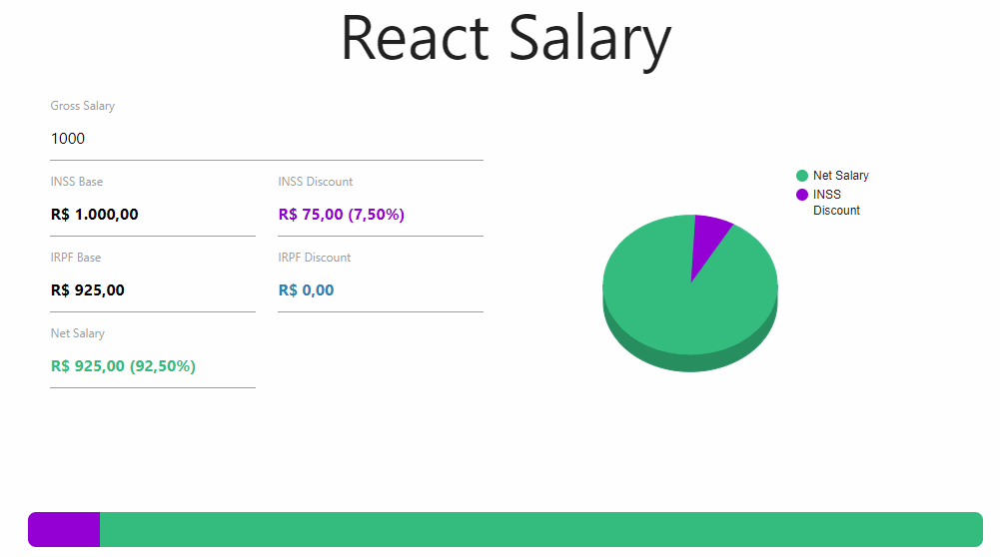

# Salary Simple Calculator

A calculator to show some taxes and the net salary (IGTI bootcamp challenge - Module 3)

# 📌 Statements
Implement, using React, an application that will have an editable input and several other read-only inputs to display information on the calculation of wages according to the CLT laws in 2020. Only the INSS and IRPF discount calculations should be considered, that is, other discounts and dependents must be ignored. The values ​​to be displayed are:

- Gross salary (editable by the user).
- INSS base (read-only).
- INSS discount (read-only).
- IRPF base (read-only).
- IRPF discount (read-only).
- Net salary (read-only)

Reference site for calculation rules and comparison of calculated values [here](https://www.todacarreira.com/calculo-salario-liquido/)

The implementation is expected to be done preferably with Class Components.

In addition to the calculations, the student must implement a horizontal bar, indicating
with different colors:

- INSS discount percentage
- IRPF discount percentage
- Net salary

# 🎯 Goals

✅ Implementation of applications with JavaScript and React

✅ Creation of class components

# 🖼️ Gif

